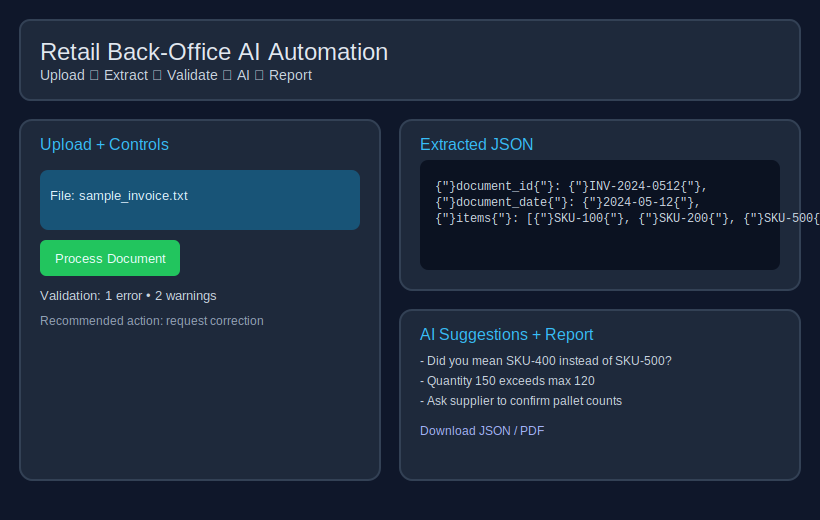

# Retail Back-Office AI Automation Demo

Small Streamlit app that ingests retail back-office documents, extracts structured data, validates it against a product catalog, proposes AI-style corrections, and produces reports (HTML in-app, downloadable JSON/PDF).

## What it does
- Upload PDF, image (PNG/JPG), text, or CSV documents.
- Extract header fields (date, document ID, supplier) and line items (SKU, name, qty, price).
- Validate with simple rules: required fields, positive quantities, catalog lookups, anomaly checks.
- Generate heuristics-based “AI suggestions” and a recommended action (approve / request correction / reject).
- Render a final report and let you download JSON/PDF outputs.
- Edit the product catalog inline in the sidebar; sample files are available to download.

## Quickstart
1. Install deps: `pip install -r requirements.txt`
2. Run: `streamlit run app.py`
3. Upload a sample (downloadable from the sidebar) and click **Process Document**.

## Inputs & Outputs
- **Inputs:** `.pdf`, `.png/.jpg`, `.txt`, `.csv`; optional catalog at `data/products.csv`.
- **Outputs:** Structured JSON, validation errors/warnings, AI suggestions, recommended action, HTML view, JSON/PDF downloads.

## OCR and AI notes
- **OCR:** Uses `pypdf` for text PDFs; falls back to `pdf2image` + `pytesseract` for scanned PDFs and images (with light preprocessing). Requires the Tesseract binary installed.
- **AI:** The AI layer is heuristic today (see `backoffice/ai.py`). You can wire in a real LLM by swapping that module and adding your client lib.

## Repo layout
- `app.py` — Streamlit UI, previews, sidebar catalog editor, and pipeline orchestration.
- `backoffice/` — ingestion, extraction, validation, AI suggestions, reporting.
- `data/products.csv` — sample catalog used for SKU validation.
- `samples/` — sample documents (downloadable in the sidebar).
- `tests/` — processing tests + reusable assets.
- `docs/mock-ui.svg` — mock UI preview.

## Validation rules (examples)
- Missing required header fields (date, ID).
- Items must have SKU and quantity; quantities > 0.
- SKU catalog presence; warn on missing name when catalog has one.
- Flag unusually high quantities based on catalog `max_quantity`.

## Testing
- Run: `python -m pytest tests/test_processing.py -q`
- Note: fpdf may emit deprecation warnings; tests still pass.

## Why this matters
- Reduces manual keying for invoices/delivery notes.
- Catches missing or anomalous data early.
- Provides suggested fixes and a clear, auditable JSON/PDF output.
